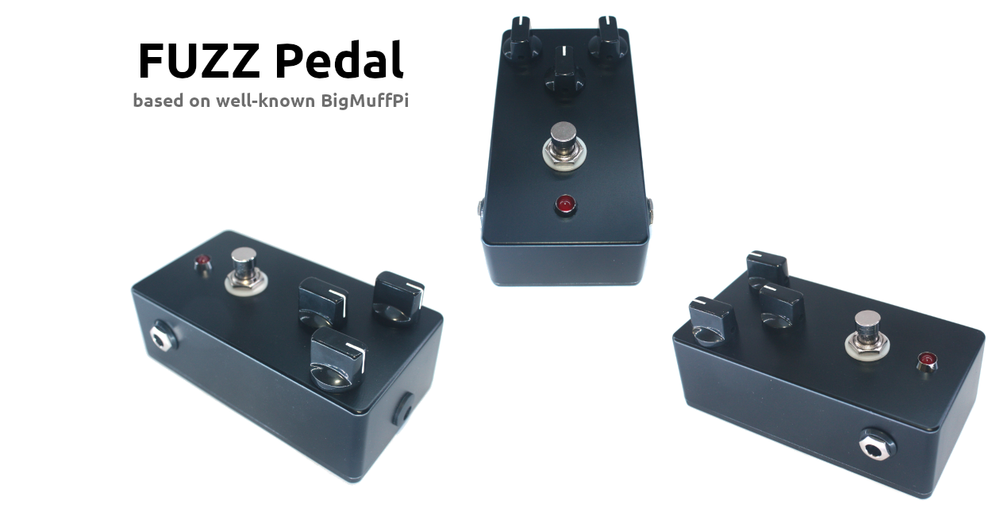

This repository contains a lot of information on how to build a Fuzz Pedal based
on well-known Big Muff PI pedal based on ElectroSmash's schematics.

### Schematics

### PCB dimensions

### 3D Render of PCB

### Photo of PCB

### Photo of assembled pedal

### Demo Reconds

Coming soon!!!

## TODO

* Add [rubber feets][1]
* Write article on how to paint Aluminum case
* Add template for drilling holes
* Update BOM (better caps, better LED holder)
* Record demo
* Try screen print on the case
* Describe screen printing process

## Cost

Here is crude cost calculation of one Pedal. Remember that this doesn't include
any tools. The shipping price could vary (in my case I had many more parcels
😕). In total one pedal cost about 50 - 60 euro (without shipping) + you would
have a few paint sprays.

| Material Type                | Quantity       | Price [EUR] |
|------------------------------|----------------|-------------|
| PCB                          | 5 (min amount) |     8.5     |
| Electronic components & Misc |      1 set     |      25     |
| Case                         |        1       |      11     |
| Ground & Color & Clear Paint |        3       |     6x3     |
| Shipping                     |       ~4       |     20x4    |

How long does it take to make a pedal? If you have any experience in soldering,
painting it will take somewhere around 33 hours mainly due waiting for paint to
dry.

| Activity Type             | Time [hours] |
|---------------------------|--------------|
| Board Soldering           |       5      |
| Case drilling             |       2      |
| Case cleaning & polishing |      0.5     |
| Case painting             |      25      |
| Assembling                |      0.5     |

## Assembling process

TODO In progress

### Order components & PCB

1. Import BOM to Mouser or Farnell and order components
2. Order the rest of the components from Aliexpress (enclosure, foot switch)
3. Import Gerber files to PCB manufacturer and order PCBs (jlcpcb.com)

### Solder board

1. TODO image of the component placement (print it)
2. Solder Transistors
3. Solder resistors
4. Solder capacitors with polarity
5. Solder capacitors
6. Solder potentiometers, jacks and switch
7.0. Be careful with screwing components
7. Prepare wires, LED with wires and power jack with wires
8. Solder LED wires and wires between boards

### Enclosure processing

TODO describe what instruments to use
1. Mark holes
2. Drill holes
3. Holes polishing
4. Enamel painting
5. Screen printing

### Assemble the pedal

1. Break the board
2. Screw switch and jacks
3. Put power jack into the enclosure
4. Solder power jack wires to the board
5. Put second board into the enclosure and screw the knobs
6. Use thermal glue to fix the board inside the case
7. Screw the bottom of the enclosure

### References

* [ElectroSmash - Big Muff PI analysis](https://www.electrosmash.com/big-muff-pi-analysis)
* [How to "Screen printing"](https://www.youtube.com/watch?v=NS8Q9LUIKA8)

[1]: http://www.diyguitarpedals.com.au/shop/index.php?main_page=product_info&cPath=15&products_id=591
[2]: http://www.caravanelectroworks.com/?p=418
[3]: http://rezzonics.blogspot.com/2018/05/nutube-screamer-schematics-bom-layout.html
